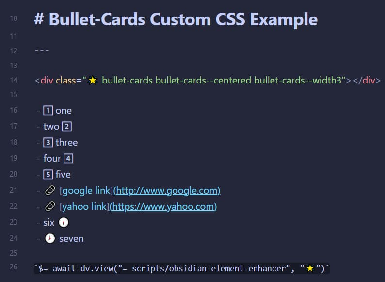
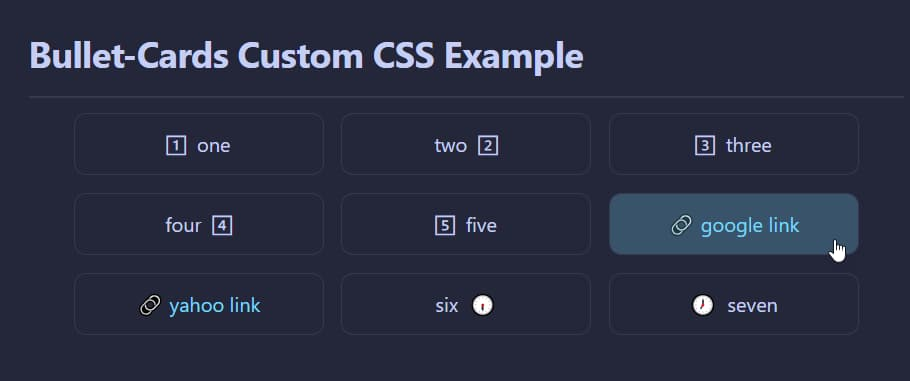
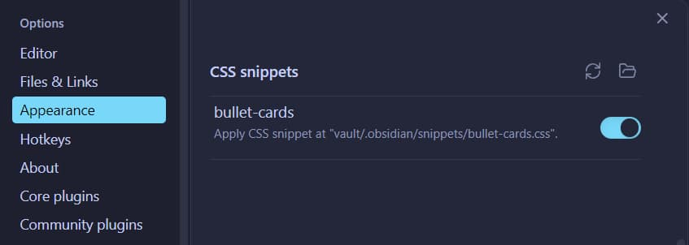

# ⏹ Obsidian Bullet Cards
css snippet to render bulleted list items as cards in Reading View (live preview not supported)

---

## Example Usage

  source view  
  

  reading view  
   

---

## Installation

- Install [`obsidian-element-enhancer`](https://github.com/jparkerweb/obsidian-element-enhancer) script to allow custom classes to be injected into the Reading View.
- Copy the `bullet-cards.css` file to your Obsidian snippets folder and enable the snippet in your Appearance preferences.
  
  

---

## Usage

- using the format specified in [`obsidian-element-enhancer`](https://github.com/jparkerweb/obsidian-element-enhancer), add a div with the `buttet-cards` custom class (and optional modifier classes):  
  `

`
- don't forget to add the following to the last line of your note (as spefiied in [`obsidian-element-enhancer`](https://github.com/jparkerweb/obsidian-element-enhancer))  
  `$= await dv.view("= scripts/obsidian-element-enhancer", "🌟")`

### Modifier Classes

The following modifer classes can be mixed and matched to achive differnt looks:

#### alignment of cards

- `bullet-cards--centered`
- `bullet-cards--left`
- `bullet-cards--right`

#### card width

- `bullet-cards--no-width`
- `bullet-cards--width1`
- `bullet-cards--width2`
- `bullet-cards--width3`
- `bullet-cards--width4`
- `bullet-cards--width5`
- `bullet-cards--width6`
- `bullet-cards--width7`
- `bullet-cards--width8`
- `bullet-cards--width9`
- `bullet-cards--width10`

#### aligment of card contents
- `bullet-cards--vertical-content`
- `bullet-cards--content-left`
- `bullet-cards--content-centered`
- `bullet-cards--content-right`

#### card padding
- `bullet-cards--padding1`
- `bullet-cards--padding2`
- `bullet-cards--padding3`
- `bullet-cards--padding4`
- `bullet-cards--padding5`
- `bullet-cards--vertical-padding1`
- `bullet-cards--vertical-padding2`
- `bullet-cards--vertical-padding3`
- `bullet-cards--vertical-padding4`
- `bullet-cards--vertical-padding5`

#### card border
- `bullet-cards--no-border`
